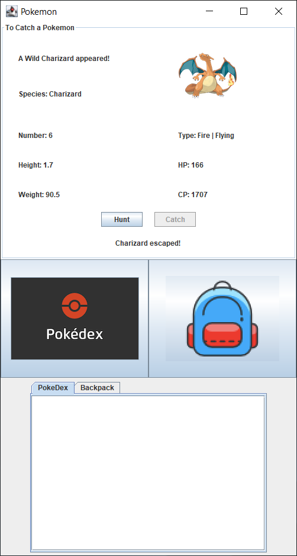

  

My first playable Pokemon game with a graphical user interface. The game is implemented by Java Gui. This game allows a player to find different kinds of Pokemon, and catch them into a player backpack. There is certain randomness that can successfully capture the Pokemon or let them escape. In addition, this Pokemon game project is a group project, it made me understand the advantages and importance of teamwork.

As a programmer, it is important to have a good coding style habit, and add comments to explain the code. Coding style plays a very important role in group projects. Chaotic coding usually cannot shorten coding time, and even increases obstacles. In this project, my teammates and I both have a good coding style, so this makes our work very efficient, and we can improve the functions of the game Gui such as adding pictures of each Pokemon, and having more debugging time.

There are many ways to improve this Pokemon game, such as adding combat functions that players could use to capture Pokemon to fight other Pokemon. The project uses many coding bases, such as nodes, queues, and binary trees, etc. Using different kinds of functions in a program is a good practice. 
