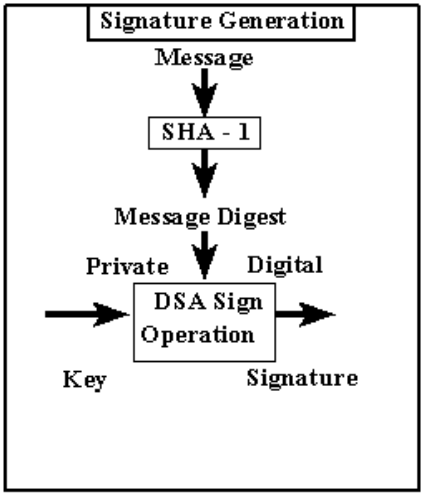

  

This project is to represent messages or data files in compressed form or encrypt form. The output is called the message digest. The verifier of the message digest must know the algorithm to get the correct message or file. Although the Federation has already published the full Secure Hash Algorithm, SHA-1, it is very challenging to recreate the encryption and compression process. In this project I am using C to create the program.

In the project, binary numbers and hexadecimal numeral systems are involved. In C or C++ languages, characters can be converted to binary numbers and hexadecimal numeral systems, and can be used in programs. By doing this project, the programmer should be able to understand more about binary numbers mask and shift features in C language. To successfully create a program, the programmer must fully understand the documentation on the Secure Hash Algorithm, SHA-1. Misunderstanding the algorithm may cause errors in the entire compression process.

Programmers will develop debugging skills informally, because under normal circumstances, the program message digest output after the Secure Hash Algorithm only has forty characters. To find the wrong coding part, a programmer will have to continue debugging. Only debug correctly to find out the error code. Overall, this project provides practice on C language and debugging skills.

Source: <a href="https://github.com/sulao1999/project-poke-and-sha/tree/main/secure-hash-standard"> Secure Hash Standard </a>

