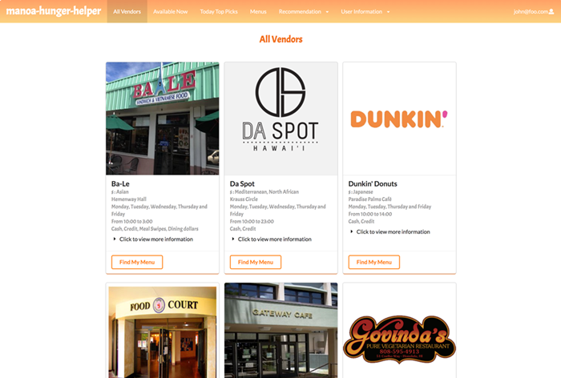

  

This is the final project of ICS 314. The main purpose is to use all the knowledge we have learned in ICS 314 to create a fully functional web application. The project is mainly aimed at people who have to spend a full day at the University of Hawaii at Manoa. UH Manoa has many different types of food vendors. Sometimes it is difficult to make a choice and keep track of when the vendor opens. The application can solve all problems. For example, it will display all vendors in UH Manoa on the All Vendors page. Allow users to find the menu on the menu page, and make the page filter out all closed vendors, the page only displays the open vendors at the time. Furthermore, the application also allow vendor to edit the information.

[More information](https://manoa-hunger-helper.github.io/)

Each person has no specific role, such as a leader, but each person is responsible for different pages of the application and database. We use milestones to make sure everyone is on the right track. In this project, everyone has an almost equal amount of work, we use GitHub to manage our code. In addition, everyone is always responsible for the pages they are assigned to, which is also helpful to teammates. In other words, everyone on the team is responsible for the entire web application.

I learned a lot from this project. For this project, the most important thing is teamwork and communication. Good teamwork and communication skills allow people to work very effectively, and we can complete the project earlier than expected, which gives us time to improve and debug the application. In this project, I practiced using GitHub, such as merge functions, JavaScript, HTML, Semantic UI and Meteor. I learned a lot from this project.

[Project Homepage](https://manoa-hunger-helper.github.io/)

